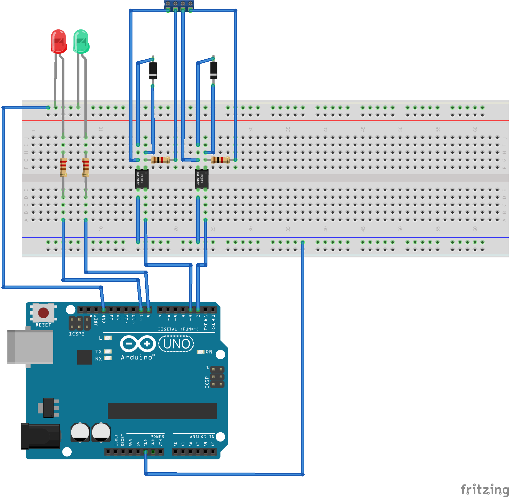

= DoorBell =

https://github.com/xxthunder/DoorBell

A simple door bell for my house. Schematics and more description will follow.
Currently just fiddling around with the pieces.

== Hardware/Part List ==

This project currently uses the following parts:

* link:https://wiki.keyestudio.com/Ks0304_Keyestudio_W5500_ETHERNET_DEVELOPMENT_BOARD_%28WITHOUT_POE%29[1 Keystudio LS0304 W5500 board]
* link:https://www.reichelt.com/gb/en/dual-optocoupler-5kv-35v-50ma-50-600-dip-8-ltv-827-p80592.html?&trstct=pos_0&nbc=1[1 dual optocoupler LTV 827]
* link:https://www.reichelt.com/gb/en/gleichrichterdiode-100-v-0-15-a-do-35-1n-4148-p1730.html?trstct=pos_1&&r=1[2 1N 4148 switching diodes]
* Some resistors, wires, etc.
* a nice case

== Software ==

* link:https://github.com/arduino-libraries/Ethernet[Arduino Ethernet Library (2.0.0)]
* link:https://github.com/knolleary/pubsubclient[Arduino Client for MQTT (v2.8)]
* IDE: Visual Studio Code plus PlatformIO

== References/Ideas ==

* https://www.reichelt.com/magazin/en/build-smart-doorbell-arduino/
* https://www.reichelt.de/magazin/how-to/smarte-tuerklingel/
* https://www.instructables.com/A-Simple-MQTT-PubSub-Node-With-Arduino-UNO-and-W51/
